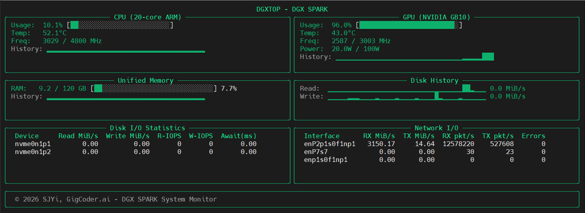

# DGXTOP for The DGX SPARK

A performance monitoring CLI tool for Ubuntu inspired by asitop for Mac, with added volume transfer speed, and RoCE monitoring.




## Features

- **Volume Transfer Speed Monitoring**: Real-time read/write speed tracking per drive
- **RoCE Counters**: Real-time monitoring of RDMA over Converged Ethernet (RoCE) statistics
- **System Monitoring**: GB10 GPU, CPU, memory, and network statistics
- **Real-time Display**: Interactive terminal interface with customizable update intervals
- **Lightweight**: Minimal dependencies, uses native Linux `/proc` filesystem
- **Per-Drive Performance**: Detailed breakdown of I/O performance for each storage device

## Installation

Download the `.deb` package and install:

```bash
wget  https://github.com/sjyi/dgxtop/blob/main/deb_build/dgxtop_1.1.0-1_all.deb
sudo apt install ./dgxtop_1.1.0-1_all.deb
```

That's it. Dependencies are installed automatically.

## Usage

### Basic Usage

```bash
dgxtop
```

### Options

```bash
dgxtop --interval 0.5        # Update every 0.5 seconds
dgxtop -i 2.0              # Update every 2 seconds
dgxtop --version           # Show version information
```

### Interactive Controls

- `q` - Quit the application
- `+` - Speed up update interval
- `-` - Slow down update interval

## Architecture

```
dgxtop/
├── __init__.py          # Package initialization
├── main.py             # Main application entry point
├── disk_monitor.py     # Disk I/O monitoring (/proc/diskstats)
├── system_monitor.py   # CPU, memory, network monitoring
├── gpu_monitor.py      # GPU monitoring (nvidia-smi)
└── display_manager.py  # Terminal UI management
```

## Technical Details

### Volume Transfer Speed Calculation

The tool calculates transfer speeds by reading `/proc/diskstats` at regular intervals:

```
Read/Write Bytes per Second = (Δsectors) × 512 bytes / Δtime
```

Where:
- `Δsectors` = Difference in sectors read/written between measurements
- `512 bytes` = Standard sector size in Linux
- `Δtime` = Time interval between measurements

### Data Sources

- **Disk Statistics**: `/proc/diskstats`
- **CPU Statistics**: `/proc/stat`
- **Memory Statistics**: `/proc/meminfo`
- **Network Statistics**: `/proc/net/dev`
- **GPU Statistics**:  `nvidia-smi`

## Requirements

- Python 3.8+
- DGX Spark with NVidia Ubuntu 
- curses (usually included with Python)

## Building from Source

### On Ubuntu

```bash
git clone https://github.com/sjyi/dgxtop.git
cd dgxtop

sudo apt install debhelper dh-python python3-all python3-setuptools dpkg-dev
dpkg-buildpackage -us -uc -b

sudo apt install ../dgxtop_1.1.0-1_all.deb
```

### On macOS (using Docker)

```bash
git clone https://github.com/sjyi/dgxtop.git
cd dgxtop

docker run --rm -v "$(pwd)":/workspace ubuntu:24.04 bash -c "
  apt-get update > /dev/null 2>&1 &&
  apt-get install -y debhelper dh-python python3-all python3-setuptools dpkg-dev > /dev/null 2>&1 &&
  mkdir -p /tmp/build_area/dgxtop && cp -r /workspace/* /tmp/build_area/dgxtop/ 2>/dev/null || true &&
  cd /tmp/build_area/dgxtop && dpkg-buildpackage -us -uc -b &&
  mkdir -p /workspace/deb_build && cp /tmp/build_area/*.deb /workspace/deb_build/
"

# Output: deb_build/dgxtop_1.1.0-1_all.deb
```

## License

APACHE 2.0 License - see LICENSE file for details.

## Contributing

1. Fork the repository
2. Create a feature branch
3. Make your changes
4. Add tests if applicable
5. Submit a pull request

## Differences from asitop for Mac

While inspired by the original asitop for Mac, this DGX Spark version:

- Uses Linux's `/proc` filesystem instead of macOS `powermetrics`
- Focuses on volume transfer speed monitoring per drive
- Provides a more generalized system monitoring approach

## Roadmap

- [ ] Add process monitoring
- [ ] Implement alerting thresholds
- [ ] Add configuration file support
- [ ] Create systemd service option
- [ ] Add network interface specific monitoring
- [ ] Implement logging functionality
