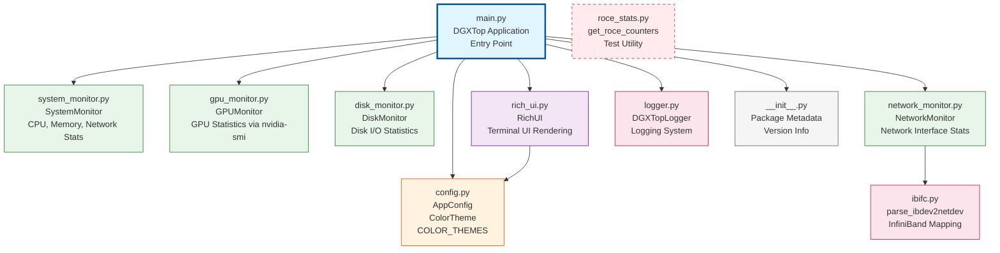

# DGXTOP Architecture Diagram

This document describes the architectural relationships between all Python modules in the DGXTOP project.

## Module Relationship Diagram



## Detailed Module Descriptions

### Entry Point Layer

#### `main.py` (DGXTop)
- **Purpose**: Main application entry point and orchestration
- **Key Class**: `DGXTop`
- **Responsibilities**:
  - Initializes all monitoring modules
  - Manages the main event loop
  - Handles keyboard input and signals
  - Coordinates data collection from all monitors
  - Updates UI with collected statistics
- **Dependencies**: 
  - All monitoring modules (SystemMonitor, GPUMonitor, DiskMonitor, NetworkMonitor)
  - UI module (RichUI)
  - Configuration (AppConfig)
  - Logging (get_logger)

### Configuration Layer

#### `config.py`
- **Purpose**: Application configuration and themes
- **Key Components**:
  - `AppConfig`: Main configuration dataclass
  - `ColorTheme`: Theme configuration
  - `COLOR_THEMES`: Predefined color themes (green, amber, blue)
- **Dependencies**: None (standalone)
- **Used By**: main.py, rich_ui.py

### Monitoring Layer

All monitoring modules follow a similar pattern: they read from system files/proc/sys and calculate rate-based statistics.

#### `system_monitor.py` (SystemMonitor)
- **Purpose**: Monitor CPU and Memory statistics
- **Data Sources**: 
  - `/proc/stat` (CPU)
  - `/proc/meminfo` (Memory)
  - `/sys/class/thermal/*` (Temperature)
  - `/sys/devices/system/cpu/*/cpufreq/*` (CPU Frequency)
- **Key Classes**: `CPUStats`, `MemoryStats`, `NetworkStats`, `SystemMonitor`
- **Dependencies**: None (standalone)

#### `gpu_monitor.py` (GPUMonitor)
- **Purpose**: Monitor NVIDIA GPU statistics
- **Data Source**: `nvidia-smi` command (subprocess)
- **Key Classes**: `GPUStats`, `GPUMonitor`
- **Dependencies**: None (standalone, requires nvidia-smi)

#### `disk_monitor.py` (DiskMonitor)
- **Purpose**: Monitor disk I/O statistics
- **Data Sources**: 
  - `/proc/diskstats` (I/O statistics)
  - `/proc/mounts` (Mounted devices)
- **Key Classes**: `DiskStats`, `DiskMonitor`
- **Dependencies**: None (standalone)

#### `network_monitor.py` (NetworkMonitor)
- **Purpose**: Monitor network interface statistics for both regular and RoCE/InfiniBand interfaces
- **Data Sources**: 
  - Regular interfaces: `/sys/class/net/*/statistics/`
  - RoCE interfaces: `/sys/class/infiniband/*/ports/*/counters/`
  - `nmcli device status` (Connected interfaces via subprocess)
- **Key Classes**: `NetworkStats`, `NetworkMonitor`
- **Key Features**:
  - Automatic detection of RoCE vs regular interfaces
  - Unified interface for reading stats from both types
  - History tracking for sparklines
- **Dependencies**: 
  - `ibifc.py` (InfiniBand device mapping - required for RoCE detection)
  - RoCE counter reading integrated directly (no external dependency)

### UI Layer

#### `rich_ui.py` (RichUI)
- **Purpose**: Terminal UI rendering using Rich library
- **Key Features**:
  - Layout management
  - Panel rendering (CPU, GPU, Memory, Disk, Network)
  - Sparkline generation
  - Progress bars
  - Color themes
- **Dependencies**: 
  - `config.py` (AppConfig)
  - Rich library (external)

### Utility Layer

#### `logger.py` (DGXTopLogger)
- **Purpose**: Comprehensive logging system
- **Key Features**:
  - File logging (detailed logs)
  - Console logging
  - Error logging (separate file)
  - Thread-safe singleton pattern
- **Key Functions**: `get_logger()`, `log_system_info()`, etc.
- **Dependencies**: None (standalone)

#### `ibifc.py`
- **Purpose**: InfiniBand device to network interface mapping
- **Key Function**: `parse_ibdev2netdev()` - Parses output from `ibdev2netdev` command
- **Returns**: Bidirectional dictionary mapping InfiniBand devices ↔ network interfaces
- **Used By**: `network_monitor.py` for RoCE interface detection
- **Dependencies**: None (standalone utility)

#### `__init__.py`
- **Purpose**: Package initialization and metadata
- **Exports**: Version, author, description
- **Dependencies**: None

### Test/Utility Scripts

#### `roce_stats.py`
- **Purpose**: Standalone utility for reading RoCE counters
- **Key Function**: `get_roce_counters()` - Reads InfiniBand port counters
- **Used By**: Test scripts (`get-roce-counts.py`)
- **Note**: Functionality also integrated into `network_monitor.py._read_roce_counters()`
- **Status**: Kept for standalone testing utilities

## Data Flow

```
┌─────────────────────────────────────────────────────────────┐
│                        main.py (DGXTop)                      │
│  ┌──────────────────────────────────────────────────────┐   │
│  │  Event Loop:                                          │   │
│  │  1. Collect stats from all monitors                  │   │
│  │  2. Aggregate data                                    │   │
│  │  3. Pass to RichUI.get_renderable()                  │   │
│  │  4. Update Live display                               │   │
│  └──────────────────────────────────────────────────────┘   │
└─────────────────────────────────────────────────────────────┘
                              │
        ┌─────────────────────┼─────────────────────┐
        │                     │                     │
        ▼                     ▼                     ▼
┌──────────────┐    ┌──────────────┐    ┌──────────────┐
│  Monitors    │    │   Config     │    │    UI        │
│              │    │              │    │              │
│ SystemMonitor│    │  AppConfig   │    │   RichUI     │
│ GPUMonitor   │    │  ColorTheme  │    │              │
│ DiskMonitor  │    │              │    │  - Panels    │
│ NetworkMonitor│   │              │    │  - Tables    │
└──────────────┘    └──────────────┘    │  - Sparklines│
        │                                │              │
        │                                └──────────────┘
        │
        ▼
┌─────────────────────────────────────────┐
│      System Data Sources                │
│  /proc/stat, /proc/meminfo              │
│  /proc/diskstats, /proc/net/dev         │
│  /sys/class/net/*/statistics/           │
│  /sys/class/infiniband/*/ports/*/counters/ │
│  nvidia-smi (subprocess)                │
│  nmcli, ibdev2netdev (subprocess)       │
└─────────────────────────────────────────┘
```

## Key Design Patterns

1. **Monitor Pattern**: All monitoring modules follow a similar structure:
   - Read raw data from system files
   - Calculate deltas/rates from previous measurements
   - Return structured dataclass objects

2. **Singleton Pattern**: Logger uses a thread-safe singleton pattern via `get_logger()`

3. **Observer Pattern**: Main loop observes all monitors and updates UI

4. **Separation of Concerns**: 
   - Monitoring logic separated from UI logic
   - Configuration separated from implementation
   - Each monitor is independent

## Module Independence

- **Fully Independent**: `config.py`, `logger.py`, `__init__.py`, `ibifc.py`
- **Independent Monitors**: `system_monitor.py`, `gpu_monitor.py`, `disk_monitor.py`
- **UI Dependent on Config**: `rich_ui.py` → `config.py`
- **NetworkMonitor Dependencies**: `network_monitor.py` → `ibifc.py`
- **Main Orchestrator**: `main.py` depends on all modules

## Recent Changes

### Files Removed (Redundancy Cleanup)
- ❌ `get_ifc.py` - Functionality integrated into `network_monitor.py`
- ❌ `enp_stats.py` - Duplicate of `roce_stats.py` functionality
- ❌ `get-enp-counts.py` - Duplicate test script
- ❌ `get-enp.counts.py` - Typo duplicate of `get-roce-counts.py`

### Code Improvements
- ✅ Fixed file handle leaks in `roce_stats.py`
- ✅ Consolidated network interface discovery in `network_monitor.py`
- ✅ Integrated RoCE counter reading directly into `network_monitor.py`

## Potential Issues

1. **Optional Dependency**: `ibifc.py` requires `ibdev2netdev` command for RoCE interface detection (fails gracefully if not available)
2. **Circular Dependencies**: None detected (clean architecture)
